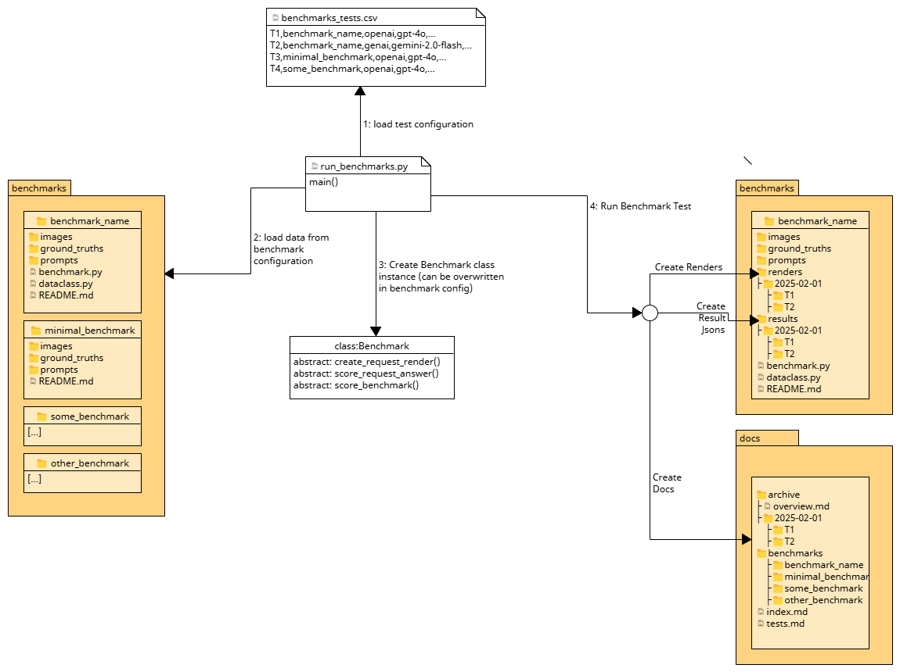

# LLM Benchmark Suite for Humanities Image Data
This repository contains a number of benchmark datasets (images), prompts, ground truths and evaluation scripts for
evaluating the performance of large language models (LLMs) on tasks in the humanities. The repository is
intended to be a resource for researchers and practitioners who are interested in evaluating the performance
of LLMs on DH-related tasks.

> **ℹ Are you looking for test results?**
  This README provides an overview of the benchmark suite and how to use it. 
  For detailed test results, please visit the [test results page](https://rise-unibas.github.io/humanities_data_benchmark/)

## Table of Contents
- [Terminology](#terminology)
- [How it Works](#how-it-works)
- [Expand on this Benchmark Suite](#expand-on-this-benchmark-suite)
  - [Create a new benchmark](#create-a-new-benchmark)
  - [API Keys](#api-keys)
  - [Run a Benchmark](#run-a-benchmark)
  - [Add Configuration to the Suite](#add-configuration-to-the-suite)
  - [Implement a Benchmark Class](#implement-a-benchmark-class)

## Terminology
- **Benchmark**: A benchmark is a task that the model should perform. Its resources consist of images and their ground truths, prompts, 
dataclasses and a scoring function. A benchmark can be used as the basis for a **test**. Each benchmark is stored in a separate directory.
- **Prompt**: A prompt is a text that is given to the model to guide its response. All prompts are stored in the `prompts` directory of the benchmark.
- **Ground Truth**: The ground truth is the correct answer to the task. It is used to evaluate the model's response. For each image, there is a ground 
truth file with the same base name.
- **Image**: An image is a visual representation of the task. The model should use the image to generate its response. Images are stored in the `images` 
directory of the benchmark.
- **Provider**: The provider is the company that provides the model. The provider can be `openai`, `genai`, `anthropic`, or `mistral`.
- **Model**: The model is the specific model that is used to perform the task. The model can be any model that is supported by the 
provider.
- **Scoring Function**: The scoring function is a function that is used to evaluate the model's response. 
It must be provided by overriding the `score_answer` method in the benchmark class.
- **Dataclass**: The use of dataclasses (or some other abstract representation of the expected output) differs from provider to provider. 
Currently, only OpenAI's dataclass feature is supported.
- **Test**: A test is a specific instance of a benchmark. A test is run with a configuration which indicates the provider, model, 
temperature, role description, prompt file and dataclass.
- **Test Configuration**: A test configuration is a set of parameters that are used to run a test. 
This suite uses a `benchmarks_tests.csv` file to store the test configurations.  
- **Request**: A benchmark test will trigger requests to the provider's API. The request consists of one or multiple images 
and a prompt. The model will generate a response based on the request. At least one, but usually multiple requests are made for each test.
- **Response**: The response is the model's answer to the task. It is a json object that contains metadata and the model's output.
- **Score**: The score is the result of the evaluation. It indicates how well the model performed on the task.


## How it Works

1. **Load Test Configuration**
2. **Load Data from Benchmark configuration**
3. **Create Benchmark class instance**
4. **Run Benchmark Tests**
   - **Create Request JSON Results**
   - **Create Request Renders**
   - **Create Request Scores**
   - **Create Benchmark Scores**
   - **Create Benchmark Result Documentation**




## Expand on this Benchmark Suite

### Create a new benchmark
To create a new benchmark, follow these steps:

- Create a new directory in the `benchmarks` folder with the name of the benchmark. 
The directory should have the following structure:

```bash
.
├── benchmarks
│   ├── <new_benchmark_name>
│   │   ├── README.md
│   │   ├── benchmark.py (optional)
│   │   ├── dataclass.py (optional)
│   │   ├── images
│   │   │   ├── image1.(jpg|png)
│   │   │   ├── image2.(jpg|png)
│   │   │   ├── ...
│   │   ├── prompts
│   │   │   ├── prompt1.txt
│   │   │   ├── prompt2.txt
│   │   │   ├── ...
│   │   ├── ground_truths
│   │   │   ├── image1.(json|txt)
│   │   │   ├── image2.(json|txt)
│   │   │   ├── ...
│   │   ├── results
│   │   │   ├── image1.json
│   │   │   ├── image2.json
│   │   │   ├── ...
```

- Create a `README.md` file with a description of the benchmark. Make sure to include a dataset description
and a description of the task that the model should perform. Explain your evaluation criteria and how the
results are scored. 
- Add images to the `images` directory. You need at least one image. Per default, one image is used with one request.
If you want to use multiple images for one prompt, format the image names like this: `image1_p1.jpg`, `image1_p2.jpg`, etc. 
This will automatically add multiple images to the same prompt. The ground truth file for this image sequence must be 
named like so: `image1.(txt|json)`.
- Add at least one prompt to the `prompts` directory. This is a simple text file with the prompt for the model.
- Add the ground truth for each image (or image sequence) to the `ground_truths` directory.
- The results are generated by the model and saved in the `results` directory. The results are saved in a JSON file

This setup will enable you to add configurations to the `benchmarks_tests.csv` file and run the benchmark with different
LLMs, prompts, and configurations.

### API Keys
To use the benchmark suite, you need to provide API keys for the different providers.
- Create a `.env` file in the root directory of the repository.
- Add the following lines to the `.env` file:

```bash
OPENAI_API_KEY=<your_openai_api_key>
GENAI_API_KEY=<your_genai_api_key>
ANTHROPIC_API_KEY=<your_anthropic_api_key>
MISTRAL_API_KEY=<your_mistral_api_key>
```

### Run a Benchmark Test
To run the suite of tests, you can use the `scripts/run_benchmarks.py` script. This script will run all the tests in the `benchmarks_tests.csv` file.

You also can use the command line interface to run a single test. For example:

```bash
python scripts/dhbm.py --name "folder_name" --provider "anthropic" --model "claude-3-7-sonnet-20250219" \
--role_description "A useful assistant." --prompt_file "prompt.txt" --api_key "your-api-key"
```

Alternatively, you can provide the configuration as a json file:

```bash
python scripts/dhbm.py --config test_config.json --api_key "your-api-key"
```
Instead of providing the api key as a command line argument, you can also set it in the `.env` file.

To run a specific test ID from the benchmarks_tests.csv file:

```python
# In scripts/run_benchmarks.py
from scripts.run_benchmarks import main
main(limit_to=["T17"])  # Run only the T17 test
```

### Add Configuration to the Suite
To add a configuration, you need to add a new row to the `benchmarks_tests.csv` file. The file has the following structure:

```csv
id,name,provider,model,dataclass,temperature,role_description,prompt_file,legacy_test
T01,test_benchmark,openai,gpt-4o,,,,,false
```

- `id`: A unique identifier for the benchmark. This can be any string.
- `name`: The name of the benchmark. This must match the name of the directory in the `benchmarks` folder.
- `provider`: The provider of the model. This can be `openai`, `genai`, `anthropic`, or `mistral`.
- `model`: The name of the model. This can be any model name that is supported by the provider.
- `dataclass`: The dataclass or schema used to structure the response of the request.
- `temperature`: The temperature parameter for the model. This can be any value between 0 and 1.
- `role_description`: A description of the role that the model should take on. This can be any description that is supported by the provider.
- `prompt_file`: The name of the prompt file in the `prompts` directory.
- `legacy_test`: A boolean value that indicates whether the benchmark is a legacy test. This can be `true` or `false`.

This allows you to run the benchmark with different models, prompts, and configurations.

### Implement a Benchmark Class
If you want to implement a custom benchmark class, you can create a `benchmark.py` file in the benchmark directory.
This file must contain a class that inherits from the `Benchmark` class. The class must be named like the benchmark 
folder but in CamelCase. Example: `TestBenchmark` for the `test_benchmark` folder.

The class can implement the following methods:

```python
from scripts.benchmark_base import Benchmark

class TestBenchmark(Benchmark):

    def score_answer(self, image_name, response, ground_truth):
        data = self.prepare_scoring_data(response)  # Extracts the relevant data from the response and returns a dictionary
        # [...] Score the answer from the model
        return {"total": 0} # Return a dictionary with scores   
        
    @property
    def convert_result_to_json(self):
        return True

    @property
    def resize_images(self):
        return True

    @property
    def get_page_part_regex(self):
        return r'(.+)_p\d+\.(jpg|jpeg|png)$'

    @property
    def get_output_format(self):
        return "json"
    
    @property
    def title(self):
        return f"{self.name} ({self.provider}/{self.model})"
```

The `score_answer` method is used to score the answer from the model. The method receives the image name, the response
from the model, and the ground truth. The method should return a dictionary with the scores. The keys of the dictionary
should be the names of the evaluation criteria, and the values should be the scores.

The rest of the methods are properties that can be used to configure the behavior of the benchmark. 
The `convert_result_to_json` property indicates whether the results should be converted to JSON format.
The `resize_images` property indicates whether the images should be resized before being sent to the model.
The `get_page_part_regex` property is a regular expression that is used to extract the page part from the image name.
The `get_output_format` property indicates the output format of the model response.
The `title` property is used to generate the title of the benchmark.